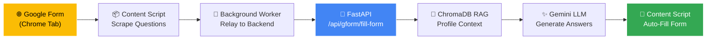
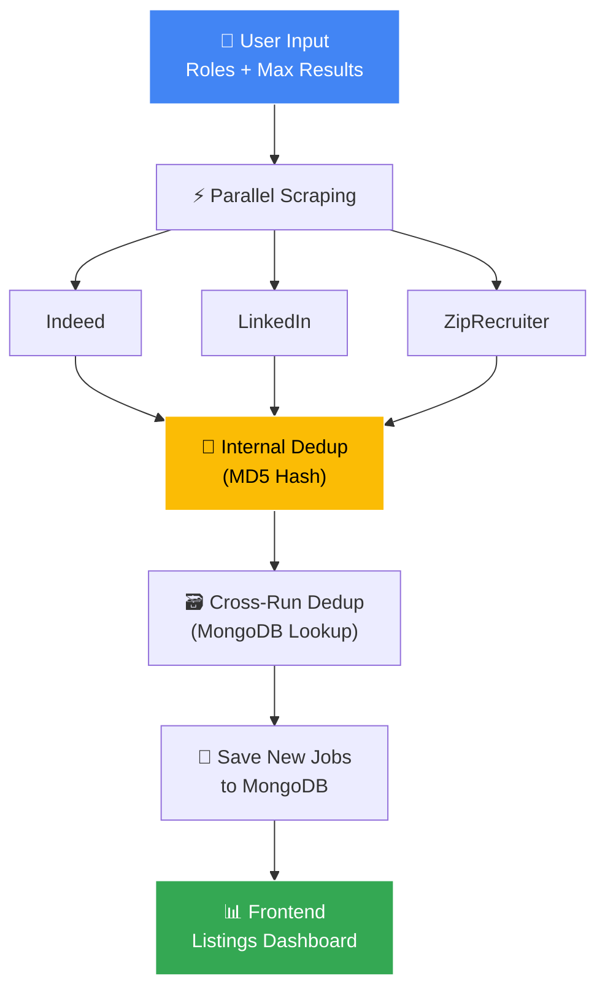
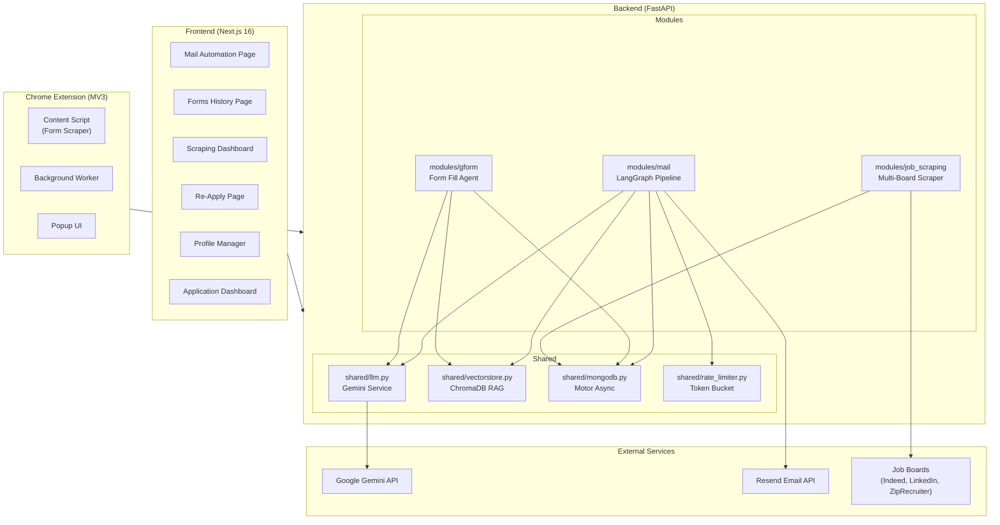

<div align="center">
  <br/>
  
  <br/><br/>

  <h1>⚡ Jobber AI</h1>
  <h3>Cold Email Automation · Google Form Filler · Job Scraping</h3>
  <p>
    An <strong>agentic AI platform</strong> that automates every repetitive step of your job search —<br/>
    from scraping openings across job boards, to drafting hyper-personalised cover emails,<br/>
    to auto-filling Google Forms — all powered by a <strong>LangGraph + RAG pipeline</strong>.
  </p>

  <p>
    
    
    
    
    
  </p>

  <p align="center">
    <a href="#-features-overview">Features</a> •
    <a href="#-cold-email-automation">Email Automation</a> •
    <a href="#-google-form-filler">Form Filler</a> •
    <a href="#-job-scraping-engine">Job Scraping</a> •
    <a href="#-architecture--tech-stack">Architecture</a> •
    <a href="#-getting-started">Setup</a>
  </p>
</div>

---

## 📋 Features Overview

| Module | What It Does | Key Tech |
|--------|-------------|----------|
| **✉️ Cold Email Automation** | Extracts job details from text/screenshots, drafts personalised cover emails using your resume context, and sends them via **Resend API through your own verified domain** (e.g., `you@yourdomain.com`) with resume attached | LangGraph, Gemini Vision, ChromaDB RAG, Resend API |
| **📝 Google Form Filler** | Chrome Extension scrapes Google Form questions, sends them to the backend, and auto-fills answers using your profile context | Chrome Extension (MV3), Gemini, ChromaDB RAG |
| **🔍 Job Scraping Engine** | Scrapes Indeed, LinkedIn, and ZipRecruiter in parallel, deduplicates against MongoDB, and presents a unified listing dashboard | python-jobspy, Gemini extraction, MD5 dedup |
| **🔄 Bulk Re-Apply** | Fetch past applications by date range, re-draft fresh cover emails, and bulk-send with concurrency-limited LLM calls | Semaphore-based rate limiting, MongoDB date queries |
| **📊 Dashboard & Profile** | Track all sent applications, manage your uploaded resume/cover letter, and monitor ChromaDB profile status | MongoDB aggregation, Next.js dashboard |

---

## ✉️ Cold Email Automation

The core feature of Jobber AI. Provide the HR email and job description — via raw text, screenshots, or even PDFs — and the system generates a tailored, professional cold email using your actual experience.

### How It Works



```mermaid
graph LR
    A["📥 User Input<br/>(text + images)"] --> B["🔍 Gemini Vision<br/>Extract Job Info"]
    B --> C["🔄 ChromaDB<br/>Duplicate Check"]
    C --> D["🧠 RAG Profile<br/>Retrieve Context"]
    D --> E["✉️ Gemini LLM<br/>Draft Cover Email"]
    E --> F["👁️ Human Review<br/>(Edit / Approve)"]
    F --> G["📤 Resend API<br/>Send + Attach PDF"]
    G --> H["📊 MongoDB<br/>Log Application"]

    style A fill:#4285F4,stroke:#fff,color:#fff
    style F fill:#34A853,stroke:#fff,color:#fff
    style H fill:#EA4335,stroke:#fff,color:#fff
```

### The LangGraph Pipeline (4-Node Graph)

The email automation is orchestrated by **LangGraph** — a stateful, graph-based workflow engine. Each step is a distinct node with typed state transitions:

| Node | Function | What Happens |
|------|----------|-------------|
| `extract_job_info` | `shared.llm.extract_job_unified()` | Gemini Vision processes text + base64 images → outputs structured JSON with `company_name`, `role`, `hr_email`, `description`, `requirements` |
| `check_duplicate` | `shared.vectorstore.check_duplicate()` | Queries ChromaDB `applied_jobs` collection with cosine similarity (threshold: 0.93). If a match is found, an LLM cross-validates before flagging as duplicate |
| `fetch_profile_context` | `shared.vectorstore.query_profile()` | RAG retrieval — queries ChromaDB `user_profile` collection with the job's role + requirements. Returns top-5 most relevant resume/project chunks |
| `generate_cover_email` | `mail.services.llm.generate_cover_email()` | Combines extracted job info + retrieved profile context into a detailed prompt. Gemini generates `{"subject": "...", "body": "..."}` |

**Conditional Edge**: After `check_duplicate`, if an `error` is present (e.g., extraction failure), the graph terminates early via `END`. Duplicates produce a **warning** (user can still override) — they don't block the pipeline.

### Two-Phase HITL (Human-In-The-Loop)

1. **Phase 1 — Draft**: `POST /api/mail/apply/unified` → accepts `FormData` (text + files) → returns `BatchDraftResponse` with all drafted emails for review
2. **Phase 2 — Confirm**: `POST /api/mail/apply/confirm` → accepts approved drafts with optional HR email overrides → sends via Resend API with resume/cover letter PDFs attached

### Multimodal Input Support

- **Screenshots**: `.png`, `.jpg`, `.jpeg`, `.webp` — uploaded or pasted from clipboard (Ctrl+V)
- **PDFs**: Automatically converted to page images using PyMuPDF, then processed by Gemini Vision
- **Raw text**: Paste job descriptions directly into the text area
- **Mixed**: Combine text instructions (e.g., *"Highlight my React skills"*) with screenshots for best results

### Multi-Job Segmentation

When you upload **multiple screenshots**, the system uses a Gemini segmentation call to identify which pages belong to which job posting. Each segment is processed independently through the LangGraph pipeline.

### Email Delivery (Resend API)

Resend dispatches emails **through your own DNS-verified custom domain** — the HR recipient sees an email from `aryan@yourdomain.com`, not a generic address. This requires a one-time domain verification in the Resend dashboard (adding DNS records).

- Sends from your verified domain via **Resend API** (e.g., `Aryan Seth <aryan@yourdomain.com>`)
- Supports multiple recipients (comma or semicolon separated)
- Automatically attaches `resume.pdf` and/or `cover_letter.pdf` from the `uploads/` directory
- Configurable `reply_to` email so HR responses land in your personal inbox

### Agent Feedback & Regeneration

After drafts are generated, you can provide **natural language feedback** (e.g., *"Draft 1 and Draft 2 are the same job — merge them"*) and the LLM regenerates all drafts in a single call, preserving batch context.

---

## 📝 Google Form Filler

A **Chrome Extension** (Manifest V3) that scrapes Google Forms, sends the questions to the backend, and auto-fills answers using your resume/profile context via RAG.

### Architecture



### How It Works

1. **Content Script** (`content.js`) — Injected into `docs.google.com/forms/*`. Scrapes all visible questions including type (text, MCQ, checkbox, dropdown) and available options
2. **Background Worker** (`background.js`) — Service worker receives scraped data, relays to the backend API
3. **Backend Pipeline**:
   - **Metadata Extraction**: LLM identifies company name and role from the form's title + questions
   - **RAG Retrieval**: Queries ChromaDB with `"Experience and skills for role {role} at {company}"` → returns top-8 profile chunks
   - **Batch Answer Generation**: Single LLM call answers all questions at once using the `BATCH_FORM_ANSWER_PROMPT` template
   - **Validation**: `AnswerValidator` checks that MCQ/checkbox answers exactly match available options (case-insensitive)
4. **Auto-Fill**: Extension fills each form field with the generated answers and provides a review UI before submission

### Supported Question Types

| Type | Handling |
|------|---------|
| Short Text | Free-form answer from profile context |
| Paragraph | Extended multi-sentence response |
| Multiple Choice | Selects the best-matching option from available choices |
| Checkbox | Multi-select from available options |
| Dropdown | Selects from dropdown options |

### Session History

Every form-fill session is persisted to MongoDB (`form_sessions` collection) with full question-answer pairs, metadata, and timestamps. Accessible via `GET /api/gform/fill-form/history`.

---

## 🔍 Job Scraping Engine

Automated job discovery across multiple job boards. Scrapes, deduplicates, and surfaces the best listings.

### Architecture



### Key Features

- **Parallel Site Scraping**: Each job board is scraped independently via `asyncio.gather()`. A 403 error from LinkedIn won't block Indeed results
- **Two-Layer Deduplication**:
  1. **Internal Dedup**: MD5 hash based on `job_apply_link` → `company|role|location` → `description[:100]` (cascading priority)
  2. **Cross-Run Dedup**: Checks each hash against MongoDB `scraped_jobs` collection to avoid re-inserting jobs from previous scrapes
- **Gemini-Powered Extraction**: For custom URLs, `BeautifulSoup` cleans the HTML, then Gemini extracts structured job listings with company, salary, location, requirements, and apply links
- **Normalized Schema**: All jobs from all sources are converted to a unified `JobListing` schema with fields like `company_name`, `salary`, `location`, `experience_required`, `hr_email_or_number`, `job_apply_link`

### API Endpoints

| Endpoint | Method | Description |
|----------|--------|-------------|
| `/api/scraper/scrape` | POST | Trigger a scrape for given roles. Body: `{"roles": ["React Developer"], "max_results_per_role": 10}` |
| `/api/scraper/listings` | GET | Browse saved jobs with optional `?role=` filter and pagination |
| `/api/scraper/listings/{job_hash}` | DELETE | Remove a specific job listing |

---

## 🔄 Bulk Re-Apply

Fetch historical applications by date range, re-draft fresh cover emails with updated profile context, and bulk-send.

### Flow

1. Select a date range (e.g., last 30 days)
2. System fetches all past applications from `applications` collection (read-only)
3. For each application, the RAG + LLM pipeline generates a **fresh** cover email (skips extraction + dedup — job info already exists)
4. Review all re-drafted emails, optionally override HR email addresses
5. Send approved ones — results are stored in the **isolated** `reapplications` collection (never touches original `applications`)

### Rate Limiting

- Uses `asyncio.Semaphore(5)` to cap concurrent LLM calls at 5
- Combined with the global `GeminiRateLimiter` (token-bucket, 15 RPM) to respect API quotas
- Exponential backoff retry (3 attempts, base delay 4s) on `ResourceExhausted` errors

---

## 🧠 RAG System (ChromaDB)

The brain of Jobber AI. Your resume, cover letters, and project descriptions are embedded and stored in ChromaDB for semantic retrieval.

### Profile Ingestion

```
POST /api/shared/ingest
```

- Upload PDF, DOCX, TXT, or MD files
- Files are parsed → chunked → embedded using `gemini-embedding-001`
- Stored in ChromaDB `user_profile` collection with HNSW cosine similarity index
- **Full refresh strategy**: Each ingestion clears and re-embeds the entire profile

### Duplicate Detection

- `applied_jobs` collection stores every sent application as an embedding
- Before drafting a new email, the system queries for cosine similarity > 0.93 within the last 20 days
- If a potential match is found, a secondary LLM call (`DUPLICATE_CHECK_PROMPT`) cross-validates to reduce false positives
- Result: user sees a duplicate warning with match details, but can still proceed

### Profile Status

```
GET /api/shared/profile/status
→ {"status": "ready", "chunks": 24, "sources": ["resume.pdf", "cover_letter.pdf"]}
```

---

## 🏗 Architecture & Tech Stack

### System Architecture



### Tech Stack

| Layer | Technology | Purpose |
|-------|-----------|---------|
| **Frontend** | Next.js 16, React 19, TailwindCSS 4, TypeScript | Responsive dashboard with drag-drop, paste, and real-time pipeline visualization |
| **Backend** | FastAPI 0.115, Python 3.10+ | Async API server with modular router architecture |
| **AI/LLM** | Google Gemini 2.0 Flash Lite (Vision + Text) | Multimodal job extraction, email generation, form answering |
| **Agent Orchestration** | LangGraph 0.2.60, LangChain Core | Stateful graph workflow with conditional edges |
| **Vector Database** | ChromaDB 0.6+ (Persistent) | Profile RAG + job deduplication with cosine HNSW |
| **Embeddings** | Gemini Embedding 001 | Text embeddings for semantic search |
| **Primary Database** | MongoDB (Motor 3.6 async) | Applications, batches, form sessions, scraped jobs, reapplications |
| **Email Delivery** | Resend API | Transactional email via your own verified domain with PDF attachments |
| **Job Scraping** | python-jobspy 1.1.x | Multi-board scraping (Indeed, LinkedIn, ZipRecruiter) |
| **Document Parsing** | PyMuPDF, python-docx | PDF → images, DOCX → text |
| **Chrome Extension** | Manifest V3 | Google Form scraping and auto-fill |
| **Rate Limiting** | Custom token-bucket + semaphore | 15 RPM global limit with exponential backoff |

### Project Structure

```
jobber-ai/
├── backend/
│   ├── main.py                    # FastAPI entry point — mounts all routers
│   ├── modules/
│   │   ├── mail/                  # ✉️ Cold Email Automation
│   │   │   ├── graph/
│   │   │   │   ├── workflow.py    # LangGraph StateGraph (4 nodes)
│   │   │   │   └── nodes.py      # Node functions (extract, dedup, RAG, draft)
│   │   │   ├── routers/
│   │   │   │   ├── apply.py       # /api/mail/apply/* (unified + confirm)
│   │   │   │   ├── reapply.py     # /api/mail/reapply/* (bulk redraft)
│   │   │   │   ├── ingest.py      # /api/shared/ingest + /api/shared/profile/*
│   │   │   │   └── jobs.py        # /api/shared/jobs + stats
│   │   │   ├── services/
│   │   │   │   ├── llm.py         # Prompt-specific wrappers around shared LLM
│   │   │   │   └── email_service.py  # Resend API integration
│   │   │   ├── models/            # Pydantic schemas (DraftState, JobInfo, etc.)
│   │   │   └── utils/             # Prompts, PDF/DOCX parsers
│   │   ├── gform/                 # 📝 Google Form Filler
│   │   │   ├── routers/
│   │   │   │   └── fill_form.py   # /api/gform/fill-form
│   │   │   ├── services/
│   │   │   │   └── validator.py   # Answer validation (MCQ/checkbox matching)
│   │   │   └── utils/
│   │   │       ├── agent_parser.py  # LLM batch answer generation
│   │   │       ├── prompts.py       # Form-specific prompts
│   │   │       └── crypto.py        # Encryption utilities
│   │   └── job_scraping/          # 🔍 Job Scraping Engine
│   │       ├── routers/
│   │       │   └── scrape.py      # /api/scraper/scrape + listings
│   │       ├── services/
│   │       │   ├── scraper.py     # python-jobspy integration
│   │       │   ├── extractor.py   # Gemini HTML→JSON extraction
│   │       │   └── dedup.py       # MD5 hash + MongoDB dedup
│   │       └── models/            # ScrapeRequest, ScrapeResponse schemas
│   ├── shared/                    # 🔧 Cross-Module Services
│   │   ├── config.py              # Pydantic SharedSettings (.env loader)
│   │   ├── llm.py                 # Gemini API: vision, text gen, embeddings
│   │   ├── vectorstore.py         # ChromaDB: ingest, query, dedup, log
│   │   ├── mongodb.py             # Motor: 7 collections, 20+ operations
│   │   ├── rate_limiter.py        # Token-bucket + exponential backoff
│   │   └── setup.py               # Shared initialization
│   ├── uploads/                   # Resume + cover letter PDFs
│   ├── chroma_data/               # ChromaDB persistent storage
│   └── requirements.txt
├── frontend/
│   ├── app/
│   │   ├── page.tsx               # Mail automation (main page)
│   │   ├── forms/                 # Form fill history
│   │   ├── scraping/              # Job scraping dashboard
│   │   ├── reapply/               # Bulk re-apply
│   │   ├── dashboard/             # Application tracking
│   │   └── profile/               # Profile management
│   ├── components/
│   │   ├── DraftCard.tsx          # Email draft review card
│   │   ├── DuplicateAlertModal.tsx # Duplicate warning modal
│   │   ├── EmailEditor.tsx        # Inline email editor
│   │   ├── FileUploader.tsx       # Drag-drop file zone
│   │   ├── FormInput.tsx          # Form field input component
│   │   ├── FormPreview.tsx        # Form preview display
│   │   ├── FormStatus.tsx         # Form fill status tracker
│   │   ├── AnswerCard.tsx         # Form answer display card
│   │   └── FeedbackPanel.tsx      # Agent feedback panel
│   ├── lib/                       # API client functions
│   └── neural-mailer-extension/   # Chrome Extension (MV3)
│       ├── manifest.json
│       ├── content.js             # Google Form scraper
│       ├── background.js          # Service worker
│       └── popup/                 # Extension popup UI
└── README.md
```

### MongoDB Collections

| Collection | Module | Purpose |
|-----------|--------|---------|
| `batches` | Mail | HITL batch storage for draft review |
| `applications` | Mail | Sent application records with full metadata |
| `reapplications` | Mail (Re-Apply) | Isolated collection for re-sent applications |
| `form_sessions` | GForm | Form-fill sessions with Q&A pairs |
| `form_applications` | GForm | Completed form applications |
| `scraped_jobs` | Job Scraping | Deduplicated job listings from all boards |

---

## 🚀 Getting Started

### Prerequisites

- **Python 3.10+** with `pip`
- **Node.js 18+** with `npm`
- **MongoDB** (local or Atlas)
- **API Keys**: Google Gemini, Resend

### 1. Backend Setup

```bash
cd backend

# Create virtual environment
python -m venv venv
venv\Scripts\activate       # Windows
# source venv/bin/activate  # macOS/Linux

# Install dependencies
pip install -r requirements.txt

# Configure environment
copy .env.example .env     # Then edit with your keys
```

**`.env` file:**
```env
GEMINI_API_KEY=your_gemini_api_key
RESEND_API_KEY=your_resend_api_key
MONGODB_URI=mongodb://localhost:27017

# Optional overrides
GEMINI_VISION_MODEL=gemini-2.0-flash-lite
GEMINI_TEXT_MODEL=gemini-2.0-flash-lite
GEMINI_EMBEDDING_MODEL=models/gemini-embedding-001
MONGODB_DB_NAME=job_agent
MAX_RPM=15
```

```bash
# Start the server
uvicorn main:app --reload --port 8000
```

### 2. Frontend Setup

```bash
cd frontend

npm install

# Configure API URL
echo NEXT_PUBLIC_API_URL=http://localhost:8000 > .env.local

npm run dev
```

### 3. Chrome Extension Setup

1. Open Chrome → `chrome://extensions/`
2. Enable **Developer mode**
3. Click **Load unpacked** → select `frontend/neural-mailer-extension/` folder
4. Navigate to any Google Form → the extension auto-activates

### 4. Build Your Profile

Before using any feature, ingest your resume:

1. Go to the **Profile** tab (`/profile`)
2. Upload your **Resume (PDF)** and optionally a **Cover Letter**
3. System chunks + embeds into ChromaDB (~20-30 chunks from a typical resume)
4. Status indicator turns green: *"Profile ready: 24 chunks from 2 file(s)"*

---

## 📡 API Reference

### Mail Automation
| Endpoint | Method | Description |
|----------|--------|-------------|
| `/api/mail/apply/unified` | POST | Phase 1: Text/files → drafted emails |
| `/api/mail/apply/confirm` | POST | Phase 2: Send approved drafts |
| `/api/mail/apply/regenerate` | POST | Regenerate drafts with feedback |
| `/api/mail/reapply/draft` | POST | Fetch & re-draft by date range |
| `/api/mail/reapply/confirm` | POST | Send re-drafted emails |

### Profile & Shared
| Endpoint | Method | Description |
|----------|--------|-------------|
| `/api/shared/ingest` | POST | Upload & embed profile documents |
| `/api/shared/profile/status` | GET | ChromaDB profile status |
| `/api/shared/profile/uploads` | GET | List uploaded files |
| `/api/shared/profile/uploads/{type}` | DELETE | Delete resume or cover letter |
| `/api/shared/jobs` | GET | List applications (paginated, filterable) |
| `/api/shared/jobs/stats` | GET | Dashboard statistics |

### Google Forms
| Endpoint | Method | Description |
|----------|--------|-------------|
| `/api/gform/fill-form` | POST | Generate answers for form questions |
| `/api/gform/fill-form/history` | GET | List past form-fill sessions |

### Job Scraping
| Endpoint | Method | Description |
|----------|--------|-------------|
| `/api/scraper/scrape` | POST | Trigger multi-board scrape |
| `/api/scraper/listings` | GET | Browse saved job listings |
| `/api/scraper/listings/{hash}` | DELETE | Remove a listing |

### Health
| Endpoint | Method | Description |
|----------|--------|-------------|
| `/api/health` | GET | Service health check |

---

## 🎨 Frontend Pages

| Page | Route | Description |
|------|-------|-------------|
| **Mail Automation** | `/` | Main page — upload jobs, review drafts, send emails with animated pipeline visualization |
| **Forms History** | `/forms` | Browse past Google Form fill sessions |
| **Job Scraping** | `/scraping` | Trigger scrapes, browse/filter/delete job listings |
| **Re-Apply** | `/reapply` | Date-range selector, bulk redraft & resend |
| **Dashboard** | `/dashboard` | Application stats, search, status tracking |
| **Profile** | `/profile` | Upload resume/cover letter, view ChromaDB status |

---

## 🔐 Environment Variables

| Variable | Required | Default | Description |
|----------|----------|---------|-------------|
| `GEMINI_API_KEY` | ✅ | — | Google Gemini API key |
| `RESEND_API_KEY` | ✅ | — | Resend email API key |
| `MONGODB_URI` | ❌ | `mongodb://localhost:27017` | MongoDB connection string |
| `MONGODB_DB_NAME` | ❌ | `job_agent` | Database name |
| `GEMINI_VISION_MODEL` | ❌ | `gemini-2.0-flash-lite` | Vision model for multimodal extraction |
| `GEMINI_TEXT_MODEL` | ❌ | `gemini-2.0-flash-lite` | Text model for generation |
| `GEMINI_EMBEDDING_MODEL` | ❌ | `models/gemini-embedding-001` | Embedding model for RAG |
| `MAX_RPM` | ❌ | `15` | Gemini API rate limit (requests/min) |
| `SENDER_EMAIL` | ✅ | — | Your DNS-verified Resend sender email (e.g., `aryan@yourdomain.com`) |
| `REPLY_TO_EMAIL` | ❌ | — | Reply-to email for sent applications |

---

<div align="center">
  <p>Built with ❤️ by <strong>Aryan</strong></p>
  <p style="font-size: 12px; color: #9e9e9e;">FastAPI · Next.js · LangGraph · Gemini · ChromaDB · MongoDB · Resend</p>
</div>
